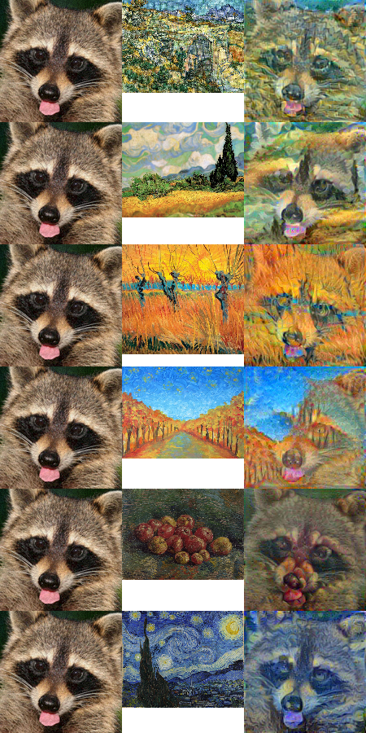

# nextflow_azure_demo
A demonstration repository on how to setup nextflow pipeline on Azure cloud

## Pipeline

This demo presents the functionality of nextflow pipeline, running neural stylization for selected images. The .csv file with desired instructions is read and passed to parallel processes, applying neural style to each of files individually

Once the processing is complete for all the images, the final image is asembled by merging all files
into single bitmap

One key goals of this pipeline is to have whole product running using Azure
cloud services. Azure account is required with a bit of credit. Free trial
is sufficient for running the pipeline on minimal capacity hardware
and no kubernetes support

## Setting up azure environment

To set up nextflow workstation, several things are needed:

* Master remote workstation. Since we are not going to run any of nextflow 
processes locally, we will be creating a remote workstation, which will serve
us as a central hub for all our operations. There, we will have access to
kubernetes services
* Cloud storage. If we want to run nextflow in kubernetes, we need a persitant storage, shared accross our pods. For that, NFS storage is required, which will hold our code, nextflow work directories and store output
* Kubernetes cluster. If we want to distribute our pipeline jobs to pods,
scaling with our pipeline depending on job needs, setting up kubernetes cluster is advised. 

### Setting up an account

Only a brief mention. Account can be created at [Azure portal](https://portal.azure.com). A Free trial may be given, which can be used to proceed with the setup for cloud services

### Creating base infrastructure with template

[Template](https://azure.microsoft.com/en-us/resources/templates/nextflow-genomics-cluster-ubuntu/), created by Lawrence Gripper, already exists in Azure resources. We will use this to kickoff base environment
for our work with nextflow. Just follow the instructions, select appropriate
hardware capacity (for free trial, only minimal capacity hardware is applicable due to quotas)

The template will create:

* NFS storage
* Virtual machine with public IP
* Virtual network
* and other things...

It is strongly adviced to use ssh key for authentication

## neural-style

It is submodule made by Anish Athalye, which serves only as a demonstration of resource-heavy process for nextflow pipeline to apply neural stylization to input images. Credits to him for making the tool!